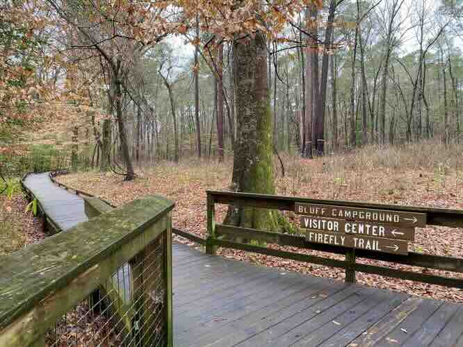
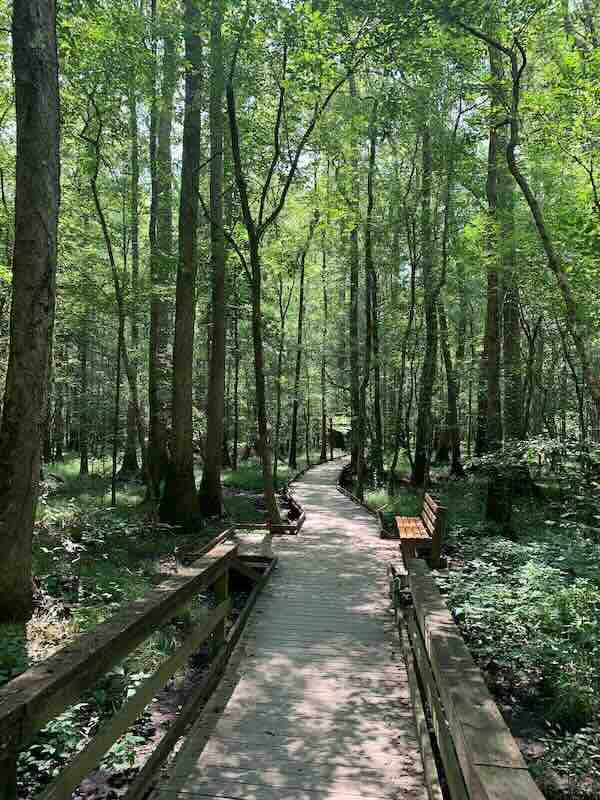

# Trail Guide

*alias: `/visit/trail-guide`*

---

## 1. Trail Guide

*id: `s1` · type: `hero`*

Eleven miles of marked trail through the creek bottom and up onto the ridge.
Open dawn to dusk, year round, no entry fee.

**cta:** Download the trail map → /visit/maps

---

## 2. Pick a trail

*id: `s2` · type: `section`*

All three loops start from the same parking area and are blazed in different
colors. Trail conditions change fast after rain — the creek crossing on the
Blue Loop is genuinely impassable in spring.

If you have never been here before, start with the Boardwalk Loop.

> **NOTE:** Confirm the Ridge Trail elevation figure with the survey before
> this goes live. Nine hundred feet is from memory.

### 2.1 Card grid

*id: `s2a` · type: `card-grid`*

#### 2.1.1 Boardwalk Loop

*id: `s2a1` · type: `card`*

Half a mile, flat, fully accessible. Elevated boardwalk over the wetland, with
benches at both ends.

#### 2.1.2 Blue Loop

*id: `s2a2` · type: `card`*

Three and a half miles along the creek. One unbridged crossing — check the
water level before you start.

#### 2.1.3 Ridge Trail

*id: `s2a3` · type: `card`*

Seven miles out and back, with about nine hundred feet of climbing. The
overlook is worth it in October.

---

## 3. Before you go

*id: `s3` · type: `callout`*

There is no cell service past the first quarter mile. Tell somebody your route,
carry water, and turn around with enough daylight to get back.

**phone:** (555) 0100

**email:** trails@example.org

---

## 4. Printable trail checklist

*id: `s4` · type: `download`*

---
